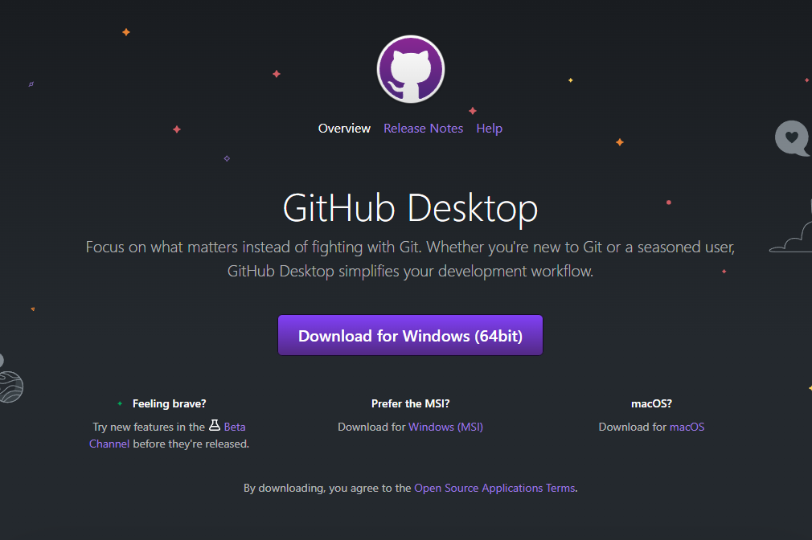

[LINK](https://talassi2f19.github.io/ProtezioneCivile/)
# PROGETTO PROTEZIONE CIVILE (2023/2024)

Il progetto "Protezione Civile" è stato realizzato su richiesta della Protezione Civile dagli studenti dell'istituto Iti Leonardo Da Vinci; si tratta di un gioco RPG (Role Play Game) multiplayer realizzato con Unity adatto a tutti i dispositivi (mobile e non). 

Lo scopo dell'applicazione è quello di mostrare ai giocatori le modalità con cui tutte le attività del Dipartimento della Protezione Civile gestiscono una situaizone d'emergenza, rendendoli partecipi delle procedure di salvaguardia popolare.

## Unity Web application

### Step 1: Installazione di elementi fondamentali 

Per poter lavorare sull'applicazione, e quindi poter apportare modifiche o semplicemente visualizzare il codice sorgente è necessario installare dei programmi.

Elementi necessari: 
- [Github Desktop](#github-desktop)
- [Unity Hub e Unity](#unity)
- [Visual Studio o altri IDE](#visual-studio-o-altri-ide)

#### Github Desktop 

Il codice dell'applicazione "Protezione Civile" è contenuto in una [repository](https://docs.github.com/en/repositories/creating-and-managing-repositories/about-repositories) di [Github](https://github.com/) condivisa con tutti gli sviluppatori; Github permette di salvare versioni differenti dello stesso codice, in modo da poter tenere tracciate le modifiche che vengono apportate su di esso.

La prima cosa da fare è creare un [account](https://github.com/join) su Github e successivamente ottenere l'accesso alla repository del progetto (al momento su invito).

Per comodità si consiglia l'installazione di [GitHub Desktop](https://desktop.github.com/)

Una volta installato, è necessario fare il login e collegare il proprio account GitHub.

#### Unity

[Unity](https://unity.com/) è una piattaforma di sviluppo software utilizzata per creare giochi 2D e 3D; per poter lavorare con Unity è necessario installare [Unity Hub](https://unity.com/unity-hub), un'applicazione desktop indipendente che ci consente di gestire in modo ordinato e centralizzato tutte le versioni di Unity che abbiamo installato e i diversi progetti e lavori che stiamo facendo.

Per utilizzare Unity Hub è necessario creare un [Unity ID](https://id.unity.com/en/conversations/112821a9-fd24-4a71-84a8-617bde55c22f005f) (un'account).

Una volta creato l'account possiamo proseguire con l'[installazione](https://unity.com/download) di Unity Hub

All'apertura di Unity Hub si deve effettuare il login con l'account precedentemente creato, e in caso richieda la licenza attivare quella [gratuita](https://support.unity.com/hc/en-us/articles/4401914348436-How-can-I-manually-activate-my-license-inside-the-Hub).

Ora è possibile installare Unity:
1. Andare nella schermata "Installs"

2. Cliccare "Install Editor"

3. Installare Unity 2022.3.15f1; molto probabilmente non comparirà nelle "Official releses", ma può essere trovata seguendo il link dell'archivio di download ([download archive](https://unity.com/releases/editor/archive))
 

    - Il link porterà ad una pagina web con tutti i download disponibili, una volta lì scaricare la versione 2022.3.15f1

    - __Importante! -> Installare il pacchetto Web GL!__

#### Visual Studio o altri IDE

Visual Studio è un ambiente di sviluppo; esso ci permetterà di modificare direttamente il codice del nostro programma.

Solitamente durante l'installazione di un pacchetto Unity viene proposta di default l'installazione di Visual Studio, in modo tale da poterlo usare come editor per il nostro codice.

Ma in caso non volessimo utilizzarlo ci sono tanti altri ambienti di sviluppo! Uno dei consigliati è [JetBrains](https://www.jetbrains.com/) di cui la scuola ci fornisce la __licenza gratuita__.

### Step 2: Lavorare sul progetto

Una volta installati tutti gli elementi necessari, è possibile iniziare a lavorare sul progetto.

1. Per prima cosa si deve clonare la repository contenente il nostro progetto in locale, perciò eseguiamo l'accesso sul sito di GitHub e apriamo la nostra repository.

    

2. Clicchiamo in alto a destra su "Code" e successivamente scegliamo l'opzione "Open with GitHub Desktop"

    

3. Cloniamo la nostra repository scegliendo il path che vogliamo
    
    

4. Una volta scaricato in locale, avremo il nostro progetto, ma per poter lavorarci deve essere collegato a Unity. Perciò apriamo Unity Hub e nella schermata "Projects" clicchiamo in alto a destra sulla freccetta difianco ad "Add", scegliamo l'opzione "Add project from disk" e aggiungiamo il path della repository clonata nel passaggio precedente.

    

5. Ecco fatto! Una volta aggiunto il progetto lo potremo trovare all'interno della sezione "Projects" su Unity Hub.

# Note per i Dev: 
layer 0: default (terra, erba ecc...)

layer 1: player (alberi, case, staccionate ecc...)

https://weeklyhow.com/unity-top-down-character-movement/#Player_Movement
